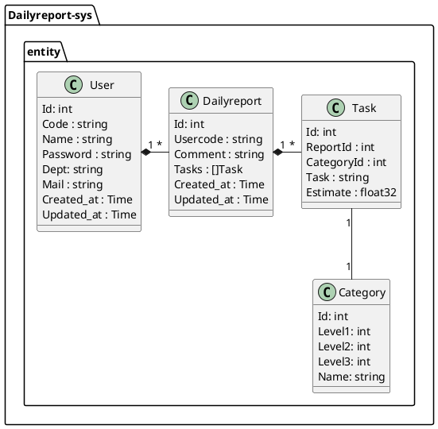

# What this ?

This repository is sinmple Daily report system.

---

# Architecture

- frontend: react
- backend: golang(Echo)
- DB: Mariadb

---

# Function

## Common
- [ ] Authentification

---

## For User
- [x] Registory daily report
- [ ] Re-edit daily report

---

## For Administrator
- [ ] List up daily report
- [x] Browse daily report
- Search daily report
    - [x] Search by Usercode
    - [x] Search by Username
    - [ ] Search by from created date
    - [ ] Search by to created date
- [ ] Add comment

---

# API

| # | method | name | description |
|:-:|:-:|:-|:-|
|1|POST|createReport|register the report data|
|2|GET|readReport|read the report data|
---

# Class Diagram

